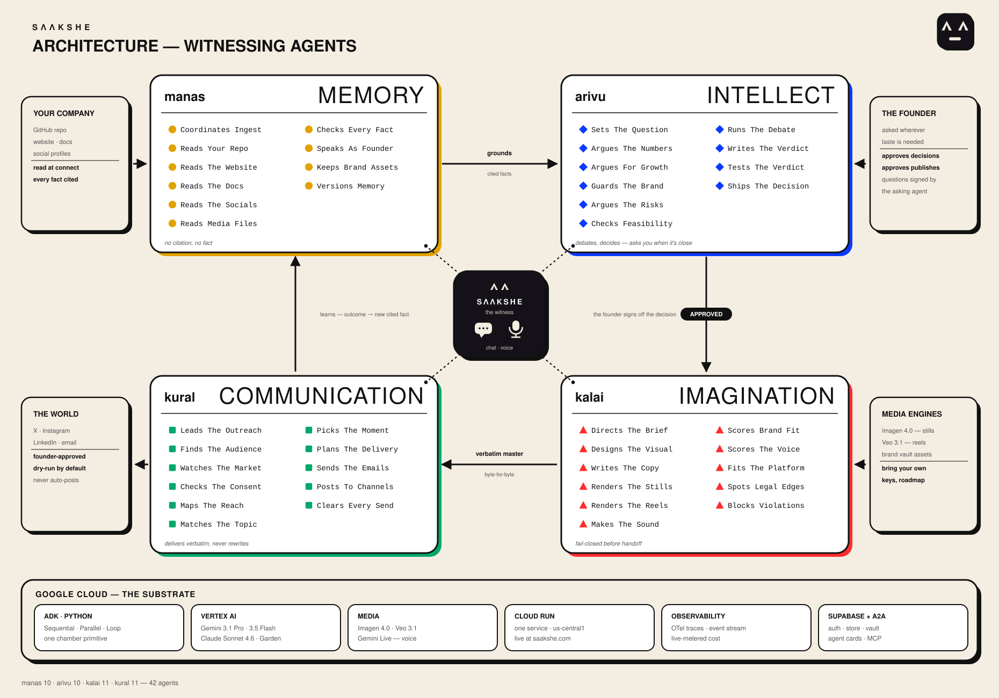

# saakshe — one founder, a whole company, one witness

**Live demo: [https://saakshe.com](https://saakshe.com)** — open access, no sign-in. The demo boots already grounded on **AIKIZI**, a real company, connected through the product's own ingest flow: live Gemini read its GitHub repo and website and extracted cited facts. Ask saakshe questions, run the day, approve the two gates.

saakshe is a startup-buddy agent system for companies that already exist (a repo plus a website). The founder talks only to **saakshe**, the witness. Behind it, three faculties do the work:

- ⬤ **manas** *knows* — versioned, source-cited memory of the company; grounds everyone; refuses out-of-corpus.
- ▲ **kalai** *makes* — all media and every word of copy.
- ◼ **kural** *engages* — carries kalai's cleared work out verbatim; authors nothing.

All three call **arivu**, the shared decision chamber. The whole day runs on exactly **two human taps**: approve the decision, approve the publish. Nothing irreversible happens without a tap.

---

## Architecture



The witness sits on top. It holds no static knowledge — it answers from live telemetry tools (`anyone_waiting`, `cost_today`, `whats_reversible`, `what_learned`, `whos_acting_now`) and refuses anything beyond its data. In live mode it speaks over Gemini Live.

Below it, the flywheel (`orchestrator.py`) runs the day:

1. **Ground** — manas builds a versioned Context Pack from the company's real repo + website: cited facts, voice, brand rules.
2. **Deliberate** — arivu's chamber argues the company decision and seals a verdict. **Gate 1: the founder taps.**
3. **Execute + make** — arivu's executor fires only after approval (dry-run is the hardcoded default); kalai renders the asset and authors the copy under a brand-fidelity panel and a fail-closed compliance gate.
4. **Engage** — kural plans delivery and holds the publish. **Gate 2: the founder taps.** Then kural carries kalai's text out byte-for-byte and manas `learn()` commits the day's decision back as a cited fact, ticking the pack version.

Errors never sink a connect, a render, or the flywheel — the run degrades and continues (fail-soft). Safety gates fail closed.

---

## The chamber primitive

The crown jewel is one reusable decision pipeline, built once in [`common/chamber.py`](common/chamber.py):

```
frame → parallel advisor panel → debate loop → Claude verdict
      → graduated prosecutor → gate
```

The prosecutor attacks the verdict; when it finds a fault, a **reviser** repairs only the faulted reason — never a full reset — so the verdict converges instead of thrashing. The skeleton has two hard rules: it never imports a faculty, and it constructs no model. arivu instantiates it via `ChamberSpec`, injecting its exact predicates — deciding factor, threshold, `human_tap` flag — so the original extraction stays byte-identical. The other faculties run chamber-shaped panels and verify-loops of their own (kalai's 4-seat brand-fidelity panel, kural's readers→planner pick, manas's curator loop) that follow the same act-then-verify pattern.

One primitive, one place to audit, and the same shape echoed in every faculty.

---

## Agent, not chatbot

**Real actions.** Token spend is metered per run (`cost_today` reads the real stream). kalai renders actual stills via Nano Banana Pro — Gemini 3 Pro Image on Vertex — in live mode (the Veo reel wrapper is shipped but the flywheel doesn't call it yet — stills are the proven path). kural's publish is a real outbound action behind a triple lock — the founder's per-tap arm flag, a deploy-level env, and a registered channel adapter must ALL be present, or it dry-runs; auto-publish is deliberately not a feature.

**Self-checking.** The debate loop forces advisors to confront each other before a verdict. The graduated prosecutor adversarially attacks the sealed verdict. kalai's brand-fidelity panel scores work against the vault's brand block. Claims are verified upstream of the mouth: manas's curator enforces no-citation-no-fact and kalai's fail-closed compliance gate clears the copy — kural carries it verbatim.

**Structural safety.** The separation contract is enforced in code, not in prompts:

- kural's delivery planner schema has **no text field** — it picks, it cannot author ([`kural/delivery.py`](kural/delivery.py)), and its assembler copies kalai's variant byte-for-byte.
- `dry_run=True` is hardcoded at both execution sites in `orchestrator.py`; a real side effect requires a human tap *and* an explicit flag.
- Compliance and publish gates fail closed; everything else fails soft.

---

## Models and modes

3rd-party LLM access is exclusively via Vertex AI.

| Seat type | Model | Where |
|---|---|---|
| Routine + panel calls | `gemini-3.1-pro-preview`, `gemini-3.5-flash` | Vertex AI |
| 8 highest-stakes seats — verdict, prosecutor, founder voice, memory curator, creative director, compliance, envoy lead, delivery planner (the prosecutor's reviser rides the verdict's model) | `claude-sonnet-4-6` | Vertex AI Model Garden |
| Stills (live) | Nano Banana Pro `gemini-3-pro-image-preview` → Nano Banana 2 `gemini-3.1-flash-image-preview` fallback (aliases accepted via `SAAKSHE_MODEL_IMAGEN`; Veo reels are wrapped but not yet wired into the flywheel) | Vertex AI |

| Mode | Gemini | Claude | Media |
|---|---|---|---|
| **demo** (default) | scripted | scripted | deterministic `vertex://` placeholder |
| **hybrid** | **real** | **real** (live Gemini understudy in the Claude seats) | real |
| **live** | **real** | **real** | real |

Demo mode is creds-free and byte-identical run to run — the entire ADK orchestration executes for real; only model token-generation is replayed, and it exists ONLY for CI and offline runs. The honest note: production today runs **hybrid** — every seat is live; the 8 Claude seats run on a live Gemini Pro understudy (real reasoning over your real question, never a replayed transcript) while our Vertex Model Garden quota resubmission is pending. The moment quota clears, one env flip puts Claude in those seats. We'd rather show you exactly where the line is than blur it. Credibility is a feature.

kalai's hands are already proven live: a real Vertex still render, generated from a brand-grounded prompt, is checked into the repo — the live path now runs Nano Banana Pro (`gemini-3-pro-image-preview`), the same model pair aikizi runs in production.


---

## Quickstart

```bash
python3.12 -m venv .venv
./.venv/bin/pip install -r requirements.txt
```

**Demo (creds-free):** the whole site — landing, onboarding, cockpit, API, voice WebSocket — on one port:

```bash
PYTHONPATH=. ./.venv/bin/uvicorn service.app:app --port 8000
# → http://localhost:8000/
```

Or run the flywheel end-to-end in the terminal:

```bash
PYTHONPATH=. ./.venv/bin/python run_flywheel.py
```

**Tests — 316 pass, 6 skipped, no credentials needed:**

```bash
for d in common manas kalai kural arivu; do PYTHONPATH=. ./.venv/bin/python -m pytest "$d" -q; done
PYTHONPATH=. ./.venv/bin/python -m pytest tests -q
```

**Hybrid (all seats live; Claude seats on a Gemini understudy):** needs a GCP project with Vertex AI enabled and ADC.

```bash
gcloud auth application-default login
cp .env.local.example .env.local   # set GOOGLE_CLOUD_PROJECT (git-ignored)
./run_hybrid_server.sh             # cockpit on :8000; ./run_hybrid.sh for the CLI run
```

**Full live (real Gemini + real Claude via Model Garden):**

```bash
./run_live.sh server               # or ./run_live.sh for the one-shot CLI flywheel
```

---

## Repo layout

```
saakshe/
├── service/app.py        # the ONE FastAPI service — site + /api + /ws/voice on one port
├── orchestrator.py       # the resumable two-tap flywheel
├── common/               # shared substrate: chamber.py · config · models · a2a ·
│                         #   project store · event stream · vault · auth · credits
├── manas/                # ⬤ knows — imbiber pods, cited Context Pack, founder voice, vault extraction
├── kalai/                # ▲ makes — creative direction, brand-fidelity panel, Nano Banana/Veo media
├── kural/                # ◼ engages — envoy lead, no-text-field delivery planner, publish gate
├── arivu/                # the shared decision chamber all three faculties call
├── witness/              # tools-over-telemetry + refusal + Gemini Live voice bridge
├── web/                  # landing · onboarding · cockpit · faculty pages
├── tests/                # cross-faculty integration + witness regression tests
├── supabase/             # migrations for the opt-in per-user store
├── deploy/seed/          # the grounded demo company state the container boots with
├── Dockerfile            # Cloud Run image (demo-seeded, hybrid/live via env)
└── run_hybrid*.sh run_live.sh deploy_cloudrun.sh
```

Faculties are imported from the repo root via `PYTHONPATH=.`; `common/__init__.py` bootstraps `arivu/` onto `sys.path`. Each faculty ships an A2A agent card, served at `/api/{faculty}/agent-card`.

---

## Evals and observability

- **Per-faculty ADK evalsets** are checked in (`manas/eval`, `kalai/eval`, `kural/eval`, `arivu/eval`) with the pass bar set at **0.8**. They are credentials-gated and have not yet been run against live models — that run happens when the Vertex quota clears. We're stating that plainly rather than implying green eval badges we don't have.
- **OTel span callbacks** (`kural/callbacks/otel.py`, mirrored from arivu) print every ADK span — panel fan-outs, gates, publishes — locally via a console exporter; the Agent Engine deployment path (`deployment/deploy.py`, `enable_tracing=True`) ships the same spans to Cloud Trace. Every OpenTelemetry import is guarded: observability never breaks a run.
- The witness reads the same event stream the spans describe — telemetry is the product surface, not an afterthought.

---

## Deploy

One service, one image, one command:

```bash
./deploy_cloudrun.sh
```

The `Dockerfile` builds the FastAPI service for Cloud Run (`us-central1`). The image is seeded with `deploy/seed/project_founder.json` — the grounded AIKIZI state — so a visitor lands on a working, grounded product, not an empty connect gate; container restarts reset to the seed, so the public demo self-heals. Hybrid/live is flipped at deploy time with `SAAKSHE_MODE=live` + the project env; on Cloud Run the service account provides Vertex credentials.

Auth and the per-user store are Supabase-backed and opt-in (`SAAKSHE_STORE=supabase`); the default store is a plain file at `~/.saakshe/`. The domain **saakshe.com** is live in front of the Cloud Run service.

---

## Why this is a business

The founder built saakshe to run his own company. He runs **AIKIZI** — a real AI image platform with an iOS app — alone, and wants to run it while traveling. He is customer zero, proudly. The live demo being grounded on AIKIZI is not a demo trick: it is the actual use, connected through the product's own ingest flow. What saakshe replaces is his own day — the historian keeping facts straight, the strategist arguing the decision, the designer-copywriter producing the asset, the channel manager carrying it out — compressed into two taps. Pricing: SaaS at $200–500/mo, with BYOK (your own Gemini, Claude-on-Vertex, and channel keys) on the roadmap.

---

## Hackathon

Built for the **Google for Startups AI Agents Challenge — Track 1 (Build)**.
Stack: **Python ADK** (`google-adk`) · **Vertex AI** (Gemini + Claude via Model Garden, Nano Banana Pro image gen, Veo, Gemini Live) · one FastAPI service on **Cloud Run** · Supabase · OpenTelemetry.
